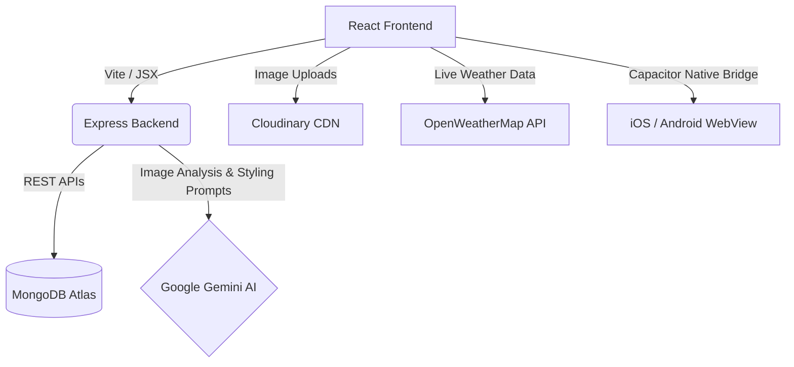

# 🪄 ClosetMate

**[🔴 Live Demo: closet-mate.vercel.app](https://closet-mate.vercel.app/)**

ClosetMate is an AI-powered smart wardrobe manager. Instead of just digitizing your clothes, ClosetMate uses Google Gemini and advanced analytics to act as your personal stylist — suggesting what to wear based on the weather, logging your outfits, and giving you deep insights into your style habits.

Built as an 8th Semester B.Tech Major Project, focusing on real-world utility, intelligent metadata extraction, sustainable fashion, and native mobile cross-platform interoperability.

---

## ✨ Core Features

*   **🎨 AI Auto-Tagging**: Upload a photo of clothing, and Gemini Vision automatically extracts the Category, Color, Season, Formality, and Style. No manual data entry needed!
*   **🌤️ Weather-Aware Daily Styling**: Uses your live local weather to automatically generate the perfect outfit combination for the day.
*   **🔐 Genuine Google Sign-In & Mobile Deep-Linking**: Implemented a secure, dynamic Google OAuth2 flow using a hybrid popup & full-page redirect fallback. Integrated with a custom iOS scheme (`closetmate://google-auth`) and native app listeners for seamless Safari-to-app authentication.
*   **👥 Community Feed**: Generate AI outfits and share them instantly to a public timeline to inspire others.
*   **📅 Outfit Calendar Log**: Automatically logs what you wear to ensure you don't repeat outfits too often.
*   **💰 Budget & Donation Tracker**: Set monthly spending limits and find "Stale" clothes you haven't worn in over a year to promote sustainable fashion donation.
*   **🧳 Smart Packing List**: Tell the AI where you're traveling and for how long, and it generates a slot-based packing checklist utilizing your exact wardrobe items.

---

## 🏗️ Architecture



---

## 🚀 Local Development Setup

### 1. Clone & Install
```bash
git clone https://github.com/abhinavAnand-26/ClosetMate.git
cd ClosetMate

# Install backend dependencies
cd backend
npm install

# Install frontend dependencies
cd ../frontend
npm install
```

### 2. Environment Variables
You will need to set up `.env` files in both the frontend and backend.

**`backend/.env`**:
```env
PORT=5001
MONGODB_URI=your_mongodb_connection_string
JWT_SECRET=your_super_secret_jwt_key
CLOUDINARY_CLOUD_NAME=your_cloud_name
CLOUDINARY_API_KEY=your_api_key
CLOUDINARY_API_SECRET=your_api_secret
GEMINI_API_KEY=your_gemini_api_key
```

**`frontend/.env`**:
```env
VITE_OPENWEATHER_KEY=your_openweathermap_api_key
VITE_API_URL=http://localhost:5001
VITE_GOOGLE_CLIENT_ID=your_google_oauth_client_id.apps.googleusercontent.com
```

### 3. Run the App
Open two terminals:
```bash
# Terminal 1 (Backend)
cd backend
npm run dev

# Terminal 2 (Frontend)
cd frontend
npm run dev
```
Visit `http://localhost:5173` to start styling!

---

## 📲 Native Mobile Deployment (Capacitor)

ClosetMate uses **Capacitor** to run as a native mobile application on physical iOS (iPhone) and Android devices.

### 1. Sync React Web Assets to Native Platforms
Every time you modify frontend assets, compile the production bundle and synchronize the iOS/Android folders:
```bash
cd frontend
npm run cap-sync
```

### 2. Open in Native IDEs
Launch the native IDEs (Xcode or Android Studio) with one command:
```bash
# Open iOS project in Xcode
npx cap open ios

# Open Android project in Android Studio
npx cap open android
```

### 3. Deep-Linking Configuration (iOS)
The app is configured to use the custom URL scheme **`closetmate://`** to listen for authentication deep-links natively.
*   **Registered Scheme**: `closetmate`
*   **Bundle Identifier**: `com.closetmate.app`
*   **Info.plist Integration**: Includes `CFBundleURLTypes` to securely transition authentication payloads from external browsers (Safari/Chrome) back into the native React app context.

---

## 🔐 Google OAuth2 Console Setup

To enable genuine Google Sign-In with active email chooser dialogs:
1. Go to the [Google Cloud Console Credentials Page](https://console.cloud.google.com/apis/credentials).
2. Configure your **OAuth Consent Screen** (set User Type to **External**, fill in developer emails, and add your test emails under **Test Users**).
3. Click **Create Credentials > OAuth client ID** (Application type: **Web application**).
4. Register the following origins:
   * **Authorized JavaScript origins**:
     - `http://localhost:5173`
     - `https://closetmate-n5l2.onrender.com`
   * **Authorized redirect URIs**:
     - `http://localhost:5173/google-callback.html`
     - `https://closetmate-n5l2.onrender.com/google-callback.html`
5. Copy the generated Client ID and paste it into `frontend/.env` as `VITE_GOOGLE_CLIENT_ID`.

---

## ☁️ Cloud Deployment Guide

### Backend (Render.com)
1. Create an account on Render.com and select **New Web Service**.
2. Connect your GitHub repository.
3. Root Directory: `backend`
4. Build Command: `npm install`
5. Start Command: `node server.js`
6. Add all your backend Environment Variables.
7. Click **Deploy**. Copy the resulting `https://your-backend.onrender.com` URL.

### Frontend (Vercel)
1. Create an account on Vercel.com and select **Add New Project**.
2. Connect the GitHub repository.
3. Framework Preset: **Vite**
4. Root Directory: `frontend`
5. Add all your `frontend/.env` variables (`VITE_API_URL` should point to the Render backend URL).
6. Click **Deploy**.
