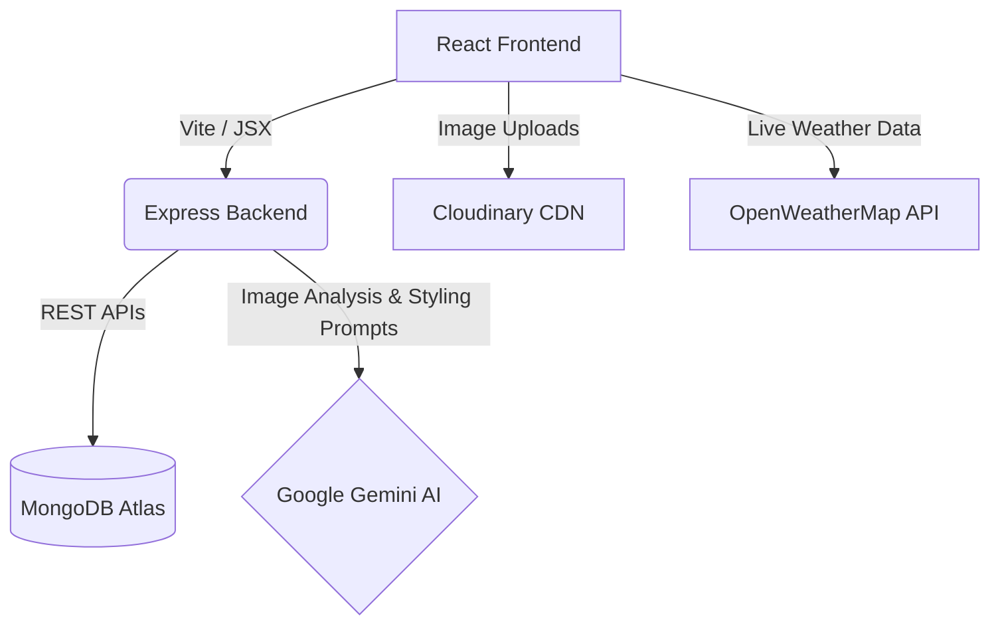

# 🪄 ClosetMate

ClosetMate is an AI-powered smart wardrobe manager. Instead of just digitizing your clothes, ClosetMate uses Google Gemini and advanced analytics to act as your personal stylist — suggesting what to wear based on the weather, logging your outfits, and giving you deep insights into your style habits.

Built as an 8th Semester Major Project, focusing on real-world utility, intelligent metadata extraction, and sustainable fashion.

## ✨ Core Features

*   **🎨 AI Auto-Tagging**: Upload a photo of clothing, and Gemini Vision automatically extracts the Category, Color, Season, Formality, and Style. No manual data entry needed!
*   **🌤️ Weather-Aware Daily Styling**: Uses your live local weather to automatically generate the perfect outfit combination for the day.
*   **👥 Community Feed**: Generate AI outfits and share them instantly to a public timeline to inspire others.
*   **📅 Outfit Calendar Log**: Automatically logs what you wear to ensure you don't repeat outfits too often.
*   **💰 Budget & Donation Tracker**: Set monthly spending limits and find "Stale" clothes you haven't worn in over a year to promote sustainable fashion donation.
*   **🧳 Smart Packing List**: Tell the AI where you're traveling and for how long, and it generates a slot-based packing checklist utilizing your exact wardrobe items.
*   **🔐 Secure Auth**: Fully JWT-secured authentication with secure password hashing.

## 🏗️ Architecture



## 🚀 Local Development Setup

### 1. Clone & Install
```bash
git clone https://github.com/abhinavAnand-26/ClosetMate.git
cd ClosetMate

# Install backend dependencies
cd backend
npm install

# Install frontend dependencies
cd ../frontend
npm install
```

### 2. Environment Variables
You will need to set up `.env` files in both the frontend and backend.

**`backend/.env`**:
```env
PORT=5001
MONGO_URI=your_mongodb_connection_string
JWT_SECRET=your_super_secret_jwt_key
CLOUDINARY_CLOUD_NAME=your_cloud_name
CLOUDINARY_API_KEY=your_api_key
CLOUDINARY_API_SECRET=your_api_secret
GEMINI_API_KEY=your_gemini_api_key
```

**`frontend/.env`**:
```env
VITE_OPENWEATHER_KEY=your_openweathermap_api_key
VITE_API_URL=http://localhost:5001
```

### 3. Run the App
Open two terminals:
```bash
# Terminal 1 (Backend)
cd backend
node server.js

# Terminal 2 (Frontend)
cd frontend
npm run dev
```
Visit `http://localhost:3000` to start styling!

## ☁️ Cloud Deployment Guide

We have optimized the application to be deployed seamlessly to modern cloud providers for free.

### Backend (Render.com)
1. Create an account on Render.com and select **New Web Service**.
2. Connect your GitHub repository.
3. Root Directory: `backend`
4. Build Command: `npm install`
5. Start Command: `node server.js`
6. Add all your backend Environment Variables.
7. Click **Deploy**. Copy the resulting `https://your-backend.onrender.com` URL.

### Frontend (Vercel)
1. Create an account on Vercel.com and select **Add New Project**.
2. Connect the GitHub repository.
3. Framework Preset: **Vite**
4. Root Directory: `frontend`
5. Environment Variables:
   - `VITE_OPENWEATHER_KEY`: Your weather API key
   - `VITE_API_URL`: Paste the Render URL you copied in the previous step!
6. Click **Deploy**.

## 📄 License
MIT License. Created by Abhinav Anand.
