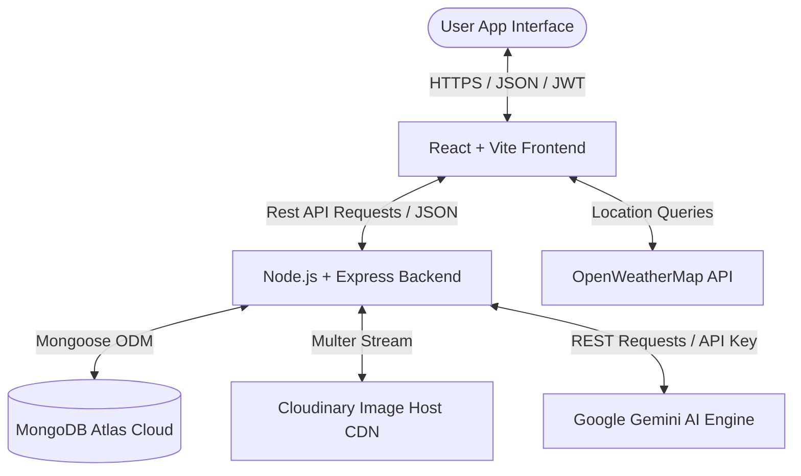
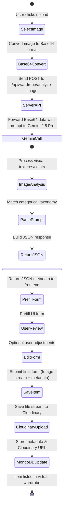
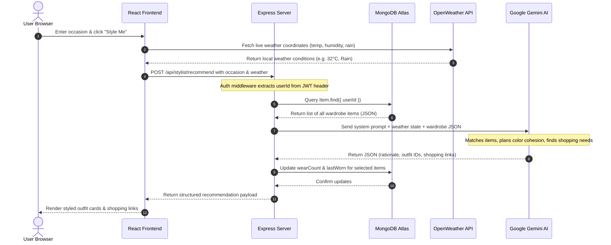
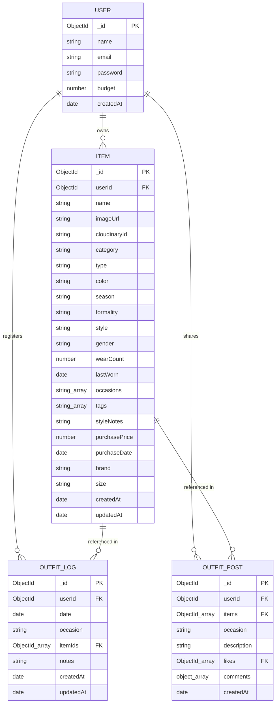

# A MAJOR PROJECT REPORT ON
# 🪄 ClosetMate: An AI-Powered Smart Wardrobe Manager and Personal Stylist

**Submitted in partial fulfillment of the requirements for the award of the degree of**
### BACHELOR OF TECHNOLOGY
**in**
### COMPUTER SCIENCE & ENGINEERING

---

## 👥 CANDIDATES' DECLARATION

We hereby declare that the work presented in this Project Report entitled **"ClosetMate: An AI-Powered Smart Wardrobe Manager and Personal Stylist"** is a bonafide record of our original work carried out under the supervision of our project guide.

We further declare that this work has not been submitted elsewhere for the award of any other degree or diploma.

**Candidates' Names:**
1. Abhinav Anand (Roll No: [Insert Roll No])
2. [Insert Partner Name, if any]

**Department of Computer Science & Engineering**
**[Insert College Name & Logo]**
**Academic Year: 2025 - 2026**

---

## 📜 CERTIFICATE OF APPROVAL

This is to certify that the project report entitled **"ClosetMate: An AI-Powered Smart Wardrobe Manager and Personal Stylist"** is a bonafide work carried out by **Abhinav Anand** in partial fulfillment of the requirements for the award of the degree of **Bachelor of Technology in Computer Science & Engineering** during the academic year 2025 - 2026.

The project work has been approved as it satisfies the academic requirements in respect of Major Project work prescribed for the B.Tech degree.

\
**________________________**  
**Internal Project Guide**  
[Insert Name & Designation]  
Department of CSE  

\
**________________________**  
**Head of Department (HOD)**  
[Insert Name & Designation]  
Department of CSE  

\
**________________________**  
**External Examiner**  
[Insert Name / Signature]  
Date: [Insert Date]  

---

## 🤝 ACKNOWLEDGEMENT

We express our deep gratitude and heartfelt thanks to our project guide, **[Insert Guide Name]**, Department of Computer Science & Engineering, for their valuable guidance, constant encouragement, and constructive suggestions throughout the course of this major project.

We are extremely grateful to **[Insert HOD Name]**, Head of the Department of Computer Science & Engineering, for providing us with the necessary facilities and support to complete this work.

We would also like to thank the faculty and staff of the Department of Computer Science & Engineering for their direct and indirect assistance in making this project successful.

Finally, we extend our heartfelt gratitude to our parents and friends for their continuous moral support and encouragement during our study.

**Abhinav Anand**  
Date: [Insert Date]

---

## 📝 ABSTRACT

Modern fashion consumers face a paradox of choice: wardrobes overflowing with clothes, yet a daily struggle to choose what to wear. Additionally, the fast-fashion boom has accelerated textile waste because clothes are frequently forgotten at the back of closets. Traditional virtual wardrobe applications merely catalog clothes as flat images, requiring laborious manual data entry and offering no intelligent assistance. 

To bridge this gap, this project presents **ClosetMate**, an AI-powered smart wardrobe manager and virtual stylist designed to revolutionize wardrobe cataloging and outfit coordination. Built as an full-stack MERN-based application, ClosetMate utilizes state-of-the-art Generative AI to digitize wardrobes, automate metadata extraction, provide custom styling, track sustainable wear patterns, and support a sharing community.

ClosetMate integrates **Google Gemini** models to deliver three core intelligent services:
1. **AI Auto-Tagging**: By leveraging computer vision, Gemini automatically extracts clothing category, primary color, seasonal suitability, formality level, and style notes from uploaded images—eliminating manual forms.
2. **AI Tag OCR Scanner**: ClosetMate scans laundry tags to extract clothing size, price (converted to INR), brand name, fabric compositions, and specific care instructions using advanced document-parsing prompts.
3. **Weather-Aware AI Stylist**: By analyzing the user's specific digitized wardrobe alongside live local weather data and the user's targeted occasion (e.g., formal meeting, holiday trip, festival), Gemini constructs a cohesive outfit (top, bottom, shoes, accessories) complete with a styling rationale. 

To prevent outfit fatigue, the stylist algorithm tracks the **wear count** of clothes and favors under-utilized pieces. If a crucial wardrobe element is missing, ClosetMate generates **AI Shopping Suggestions** featuring links to real Indian e-commerce platforms (Myntra, Ajio, Tata CLiQ) and price estimates. The system includes an **Outfit Calendar Log** to record daily wear, an **Analytics Dashboard** tracking wardrobe distribution and identifying "stale" (unused) clothes for donation, and a **Community Feed** for users to publish outfit inspiration. Secured by JSON Web Tokens (JWT) and bcrypt hashing, ClosetMate showcases how artificial intelligence, cloud databases, and web engineering can combine to promote sustainable fashion and simplify personal styling.

---

## 📂 TABLE OF CONTENTS

*   **Front Pages**
    *   Title Page
    *   Candidates' Declaration
    *   Certificate of Approval
    *   Acknowledgement
    *   Abstract
    *   List of Figures
    *   List of Tables
*   **Chapter 1: INTRODUCTION**
    *   1.1 Project Overview
    *   1.2 Motivation & Problem Statement
    *   1.3 Scope of the Project
    *   1.4 Objectives
    *   1.5 Document Conventions
*   **Chapter 2: REQUIREMENT ANALYSIS AND SPECIFICATION**
    *   2.1 Hardware Requirements
    *   2.2 Software Requirements
    *   2.3 Functional Requirements
    *   2.4 Non-Functional Requirements
    *   2.5 Feasibility Study (Technical, Economic, Operational)
*   **Chapter 3: SYSTEM DESIGN**
    *   3.1 System Architecture
    *   3.2 UML Diagrams (Use Case, Activity, Sequence, Data Flow Diagrams)
    *   3.3 Database Design & ER Diagram
    *   3.4 Module Description
*   **Chapter 4: METHODOLOGY & IMPLEMENTATION**
    *   4.1 Development Methodology
    *   4.2 Core Algorithms and AI Prompts
        *   4.2.1 AI Auto-Tagging Prompt Design
        *   4.2.2 AI Tag Scanner OCR Prompt Design
        *   4.2.3 AI Weather-Aware Styling Recommendation Prompt Design
        *   4.2.4 AI Smart Packing List Prompt Design
    *   4.3 Key REST API Routes
    *   4.4 Implementation Highlights & Environment Setup
*   **Chapter 5: SYSTEM TESTING & RESULTS**
    *   5.1 Testing Methodology
    *   5.2 Test Cases (Tabular Format)
    *   5.3 System Screen Captures and Visual Walkthrough
*   **Chapter 6: CONCLUSION & FUTURE SCOPE**
    *   6.1 Conclusion
    *   6.2 Future Scope
*   **References**

---

## 📈 LIST OF FIGURES

1.  *Figure 3.1: ClosetMate 3-Tier System Architecture Block Diagram*
2.  *Figure 3.2: Use Case Diagram of ClosetMate System*
3.  *Figure 3.3: Activity Diagram for Adding Wardrobe Item (AI Auto-Tagging)*
4.  *Figure 3.4: Sequence Diagram for Weather-Aware Outfit Recommendation*
5.  *Figure 3.5: Entity-Relationship (ER) Diagram of ClosetMate*
6.  *Figure 4.1: Flowchart representing the AI Auto-Tagging Pipeline*
7.  *Figure 4.2: Flowchart representing the Smart Tag OCR scanning Pipeline*

---

## 📊 LIST OF TABLES

1.  *Table 2.1: Software Stack Specifications*
2.  *Table 2.2: Hardware Specifications for Client & Host Servers*
3.  *Table 3.1: MongoDB Schema Structures*
4.  *Table 4.1: Backend REST Endpoints*
5.  *Table 5.1: Functional Test Cases and Validation Results*

---
---

# 🚀 CHAPTER 1: INTRODUCTION

## 1.1 Project Overview
**ClosetMate** is a full-stack, cloud-based smart wardrobe management and personalized artificial intelligence styling application. In an era dominated by rapid fashion trends and vast clothing options, individuals struggle with outfit coordination, frequently repeating a narrow set of outfits while leaving up to 80% of their wardrobe unused. ClosetMate addresses this bottleneck by digitizing wardrobes, allowing users to upload clothing items to the cloud, and leveraging Google Gemini AI to analyze clothing details. It acts as a personal fashion stylist, suggesting weather-appropriate and occasion-specific combinations using the clothes the user already owns. 

ClosetMate incorporates:
*   Secure JSON Web Token (JWT) based user registration and authentication.
*   Cloudinary-powered secure Content Delivery Network (CDN) for fast image hosting.
*   Computer vision models for auto-tagging categories, primary colors, styles, seasons, and formalities.
*   OCR-driven tag scanning to read garment labels and automatically extract article details, brand names, fabrics, and pricing.
*   Intelligent weather-aware daily recommendation engine using live OpenWeatherMap API details.
*   A localized e-commerce shopping recommendation pipeline utilizing top Indian retail platforms (Myntra, Ajio, Tata CLiQ) when matching outfits require missing clothing items.
*   Comprehensive statistics/analytics identifying under-utilized ("stale") items to promote sustainable fashion and decluttering.
*   A collaborative social feed enabling community style-sharing.

## 1.2 Motivation & Problem Statement
The fashion industry has transformed dramatically over the last decade. High-velocity consumerism and fast fashion have lowered prices, leading to massive accumulations of clothing items. However, this abundance has resulted in the "Closet Paradox"—consumers spend excessive time selecting outfits daily, yet a significant portion of their wardrobe lies forgotten at the bottom of the drawer. 

Furthermore, existing wardrobe tools fail because:
1.  **Laborious Manual Input**: Manually entering categories, fabrics, sizes, colors, and purchase dates for dozens of garments is tedious, leading to high user abandonment rates.
2.  **Lack of Real Utility**: Most applications act as simple static catalog grids. They lack the intelligence to dynamically recommend outfits, ignoring crucial factors like current weather patterns, individual style notes, and the specific event formality.
3.  **Environmental Waste**: Unworn clothing represents massive wasted capital and environmental degradation. There is a lack of integration mapping wardrobe utility to identify "stale" clothes for recycling or donation.

ClosetMate is designed to solve these issues by automating data entry using Multimodal AI (Google Gemini Vision) and by utilizing advanced analytics to prompt regular rotation of wardrobe items.

## 1.3 Scope of the Project
ClosetMate provides an end-to-end service for retail consumers, university students, and fashion enthusiasts. The scope spans across:
*   **Virtual Digitization**: High-speed cataloging of physical closets into cloud storage.
*   **AI Fashion Advisor**: Immediate generation of stylish outfits suited for traditional Indian festivals (Holi, Diwali, Eid), formal corporate events, travel, and casual occasions.
*   **Financial & Sustainability Tracker**: Wardrobe cost and budget tracking, wear-counter logic, and stale clothing identification (unworn for 365+ days) to optimize closet sustainability.
*   **Social & Collaborative Hub**: Building a feed where styles and generated combinations can be shared, commented on, and liked to promote social interaction.

## 1.4 Objectives
*   To design a modern React and Node.js RESTful web app characterized by a stunning dark-mode glassmorphism interface.
*   To implement computer vision pipelines using Gemini's API to eliminate manual clothing data entry.
*   To create a weather-aware clothing recommendation algorithm by combining live meteorological data from OpenWeatherMap and personal clothing tags.
*   To integrate secure image uploads via Multer and Cloudinary CDNs.
*   To build statistical engines tracking closet value, category proportions, and item wear frequencies.
*   To support JWT-based route protection to ensure individual user wardrobes remain entirely private and isolated.

## 1.5 Document Conventions
*   **AI / LLM**: Artificial Intelligence / Large Language Model (specifically Google Gemini).
*   **MERN**: MongoDB, Express.js, React, Node.js.
*   **JWT**: JSON Web Token for secure authentication.
*   **OCR**: Optical Character Recognition.
*   **CDN**: Content Delivery Network (Cloudinary).

---

# 📋 CHAPTER 2: REQUIREMENT ANALYSIS AND SPECIFICATION

## 2.1 Hardware Requirements
To run, develop, and host the ClosetMate application, the minimum and recommended hardware standards are detailed below:

### Server/Hosting Hardware
*   **CPU**: 2 Core Virtual Processors (Minimum), 4 Cores or higher (Recommended).
*   **RAM**: 1 GB (Minimum), 4 GB (Recommended for local builds).
*   **Storage**: 500 MB Available space for project files (Database uses cloud MongoDB Atlas).

### Client Machine Hardware (User Interface)
*   **Device**: Smartphone, Tablet, or PC.
*   **RAM**: 2 GB RAM (Minimum), 4 GB RAM (Recommended).
*   **Display**: Minimum resolution of 360x640 (Mobile responsive layout) up to 1920x1080 (Desktop screens).

## 2.2 Software Requirements
The developer stack and environment setup require the following:

| Layer | Component | Specification |
|---|---|---|
| Operating System | Server / Development | macOS / Linux / Windows 10+ |
| Runtime Environment | Node.js | v18.0.0 or higher (LTS recommended) |
| Web Framework (Frontend) | React.js | v18.2.0 (Vite build system) |
| Server Framework | Express.js | v4.18.2 |
| Database Engine | MongoDB | v6.0+ (Mongoose ODM v8.0+) |
| Styling Interface | CSS3 | Vanilla CSS with flexbox, grid, variable styling |
| State Management | React Context API | For Authentication and User Profile states |
| Third-Party Cloud CDN | Cloudinary | Upload API v2 |
| External APIs | weather API & AI | OpenWeatherMap API & Google Gemini Generative AI SDK |

## 2.3 Functional Requirements
ClosetMate provides the following key functional capabilities:
*   **F1: Secure User Account Management**: Users must register with username, email, and password. The system must hash passwords and issue temporary JWT tokens. Users can log out, view their profile, and set monthly fashion spending budgets.
*   **F2: Multi-Modal Wardrobe Cataloging**:
    *   *Manual Upload*: Fill category, brand, size, colors, purchase date, and price manually.
    *   *AI Auto-Tagging*: Upload clothing photos; Gemini extracts color, formality, style, season, and occasion.
    *   *Tag Scanner*: Upload tag labels; Gemini does OCR and fills fabric, size, and pricing fields automatically.
*   **F3: Daily Styled Recommendations**: Uses OpenWeatherMap API to retrieve current weather and suggests complete outfit sets matching user-defined occasions.
*   **F4: Travel Smart Packing Checklist**: User enters trip destination, duration, and activities; Gemini builds a checklist utilizing the user's digitized clothes.
*   **F5: Outfits Calendar Tracker**: Logs everyday outfits onto a calendar to log wear count.
*   **F6: Sustainable Wardrobe Analytics**: Generates graphs on wardrobe distribution, identifying unused garments for charity.
*   **F7: Social Style Sharing**: Share outfits onto a public feed where community members can like and comment.

## 2.4 Non-Functional Requirements
*   **Security**: All client-server communications use HTTPS. Passwords hashed using `bcryptjs` with 10 salt rounds. Database queries isolated by JWT headers to prevent cross-account leaks.
*   **Performance**: Auto-tagging must resolve in under 4 seconds. General REST requests must execute in less than 500ms.
*   **Usability**: Fluid responsive interface optimized for mobile viewports using a premium dark-mode glassmorphic theme.
*   **Scalability**: Stateless Express server enables easy horizontal scaling. Images hosted on Cloudinary to reduce database payload.

## 2.5 Feasibility Study
*   **Technical Feasibility**: The integration of MERN stack is highly feasible due to robust ecosystem support. The availability of Google's new `@google/genai` Node.js SDK makes multimodal vision and JSON structure mapping highly reliable.
*   **Economic Feasibility**: Development relies on open-source packages. Hosting uses free-tier MongoDB Atlas, Cloudinary, Render, and Vercel, making the system highly economical to run.
*   **Operational Feasibility**: By automating the tedious cataloging step through Gemini Vision, users are highly likely to operate the system routinely compared to older manual platforms.

---

# 🎨 CHAPTER 3: SYSTEM DESIGN

## 3.1 System Architecture
ClosetMate follows a 3-tier architectural model:
1.  **Presentation Layer (Frontend)**: React SPA built with Vite. It manages state transitions via Context API, performs JWT token storage in `localStorage`, and displays the premium glassmorphism components.
2.  **Application Layer (Backend Server)**: A Node.js and Express RESTful API server. It manages routing, processes image streams using Multer, handles authentication middleware, interacts with the Gemini AI models, and queries weather databases.
3.  **Database/Storage Layer (Data Services)**: MongoDB Atlas serves as the document store, hosting secure document collections. Cloudinary acts as the file blob storage and CDN for uploaded wardrobe images.



## 3.2 UML Diagrams

### Use Case Diagram
The Use Case diagram shows the interactions between the primary actor (Authenticated User) and the core modules of ClosetMate:

```mermaid
leftToRightDirection
actor User as "Authenticated User"
actor Gemini as "Google Gemini AI"
actor Weather as "OpenWeather API"

rectangle ClosetMate_System {
    usecase UC1 as "Register / Login Account"
    usecase UC2 as "Upload Clothing Image"
    usecase UC3 as "Trigger AI Auto-Tagging"
    usecase UC4 as "Scan Garment Tag (OCR)"
    usecase UC5 as "Get AI Outfit Recommendations"
    usecase UC6 as "Create Packing Checklist"
    usecase UC7 as "Log Outfit to Calendar"
    usecase UC8 as "View Wardrobe Analytics"
    usecase UC9 as "Post to Community Feed"
}

User --> UC1
User --> UC2
User --> UC3
User --> UC4
User --> UC5
User --> UC6
User --> UC7
User --> UC8
User --> UC9

UC3 --> Gemini
UC4 --> Gemini
UC5 --> Gemini
UC5 --> Weather
UC6 --> Gemini
```

### Activity Diagram: Upload & Auto-Tag Item
This diagram represents the sequential workflow executed when uploading a new item and auto-tagging it using Gemini Vision:



### Sequence Diagram: Weather-Aware Recommendation
This diagram demonstrates the runtime messaging patterns during an AI stylist request:



## 3.3 Database Design & ER Diagram
ClosetMate uses Mongoose ODM to model four structural schemas on MongoDB: `User`, `Item` (Wardrobe Item), `OutfitLog` (Calendar logs), and `OutfitPost` (Community).



### Table Structure Mappings

#### 1. User Collection Schema
```javascript
{
  name: { type: String, required: true },
  email: { type: String, required: true, unique: true },
  password: { type: String, required: true },
  budget: { type: Number, default: null },
  createdAt: { type: Date, default: Date.now }
}
```

#### 2. Item Collection Schema
```javascript
{
  userId: { type: mongoose.Schema.Types.ObjectId, ref: 'User', required: true },
  name: { type: String, default: '' },
  imageUrl: { type: String, required: true },
  cloudinaryId: { type: String, required: true },
  category: { type: String, required: true },
  type: { type: String, default: '' },
  color: { type: String, required: true },
  season: { type: String, required: true },
  formality: { type: String, required: true },
  occasions: { type: [String], default: [] },
  style: { type: String, default: '' },
  gender: { type: String, default: 'Unisex' },
  wearCount: { type: Number, default: 0 },
  lastWorn: { type: Date, default: null },
  tags: { type: [String], default: [] },
  styleNotes: { type: String, default: '' },
  purchasePrice: { type: Number, default: null },
  purchaseDate: { type: Date, default: Date.now },
  brand: { type: String, default: '' },
  size: { type: String, default: '' }
}
```

#### 3. OutfitLog Collection Schema
```javascript
{
  userId: { type: mongoose.Schema.Types.ObjectId, ref: 'User', required: true },
  date: { type: Date, required: true },
  occasion: { type: String, default: '' },
  itemIds: [{ type: mongoose.Schema.Types.ObjectId, ref: 'Item' }],
  notes: { type: String, default: '' }
}
// Compounded index: { userId: 1, date: 1 } for fast calendar parsing
```

#### 4. OutfitPost Collection Schema
```javascript
{
  userId: { type: mongoose.Schema.Types.ObjectId, ref: 'User', required: true },
  items: [{ type: mongoose.Schema.Types.ObjectId, ref: 'Item', required: true }],
  occasion: { type: String, required: true },
  description: { type: String, default: '' },
  likes: [{ type: mongoose.Schema.Types.ObjectId, ref: 'User' }],
  comments: [{
    userId: { type: mongoose.Schema.Types.ObjectId, ref: 'User' },
    userName: String,
    text: String,
    createdAt: { type: Date, default: Date.now }
  }],
  createdAt: { type: Date, default: Date.now }
}
```

## 3.4 Module Description
*   **Authentication & Security Module**: Controls register/login functions. Validates password hashes via bcrypt, signs JWT tokens, and locks all endpoints behind request header checks.
*   **Virtual Closet Catalog Module**: Handles file stream uploading to Cloudinary using standard multipart-form Multer rules. Allows listing, searching across nested keywords, filtering, editing, and deleting items.
*   **Gemini AI Engine Module**: Connects Express backend to Google's generative models (`gemini-2.5-pro` and newer versions) to execute vision, OCR, and outfit recommendations using strict instructions to output raw, parseable JSON payloads.
*   **Interactive Stylist & Trip Pack Module**: Allows daily styling matching current outdoor temperatures. Tracks clothes wear patterns to guarantee sustainable outfit combinations. Generates tailored trip packing checklists with day-by-day itineraries.
*   **Sustainable Analytics & Calendar Module**: Aggregates total spend versus active budget. Maps category counts to render beautiful distribution charts. Displays calendar grids with worn outfits, updating wear logs, and finding stale items.
*   **Community Timeline Module**: Allows users to publish their coordinate outfits onto a central public feed where other authenticated members can interact (comment, delete, like).

---

# 🛠️ CHAPTER 4: METHODOLOGY & IMPLEMENTATION

## 4.1 Development Methodology
The system was engineered using the **Agile Iterative Lifecycle Model**:
1.  **Sprinting**: Divided into 6 main phases, prioritizing fundamental data stores first (Phase 1-2: Auth, Mongoose & Cloudinary setup), followed by AI integrations (Phase 3: Stylist API), analytical/social functions (Phase 4-5: Stats, Calendar & Community), and finally security locking (Phase 6: Isolated Route Middleware).
2.  **Code Consistency**: Predefined custom design tokens (written directly in vanilla `index.css`) maintain visual harmony (e.g., standardizing glassmorphism variables like background shadows, backdrop blur filters, and neon-dark gradients).

## 4.2 Core Algorithms and AI Prompts
At the heart of ClosetMate's intelligence are system prompt pipelines that communicate with Google Gemini to guarantee accurate responses. Below are the original prompt parameters used in our production codebase:

### 4.2.1 AI Auto-Tagging Prompt Design
The prompt used when uploading a garment image to `/api/wardrobe/analyze-image`:
```text
You are a premium fashion AI stylist. Analyze this clothing image and return structured metadata.

Return ONLY a raw JSON object with EXACTLY these fields:
{
  "gender": "Men", "Women" or "Unisex",
  "category": One of ["Tops", "Bottoms", "Dresses", "Loungewear", "Ethnic Wear", "Footwear", "Accessories", "Jewelry", "Outerwear", "Activewear"],
  "type": Specific type from the category (e.g., "Oversized T-shirt", "Palazzo", "Saree", "Heels", "Kurta Pajama"),
  "color": Primary color name (Prefer standard colors: "Black", "White", "Blue", "Red", "Green", "Beige", "Brown", "Grey", "Navy", "Pink", "Yellow", "Orange", "Purple", "Maroon", "Olive", "Teal". If it is a distinct shade, use that shade, e.g. "Burgundy", "Peach", "Mint Green", "Rust"),
  "season": One of ["Summer", "Winter", "Rainy", "All Season"],
  "formality": One of ["Casual", "Semi-Formal", "Formal", "Party", "Ethnic", "Sporty"],
  "style": One of ["Minimal", "Streetwear", "Classic", "Bohemian", "Gothic", "Sporty", "Vintage", "Chic"],
  "occasions": Array of ["Casual", "Office", "Wedding", "Date Night", "Festival", "Travel", "Gym", "College", "Party"],
  "styleNotes": A single premium styling tip (e.g., "Pairs perfectly with high-waisted trousers for a chic office look.")
}

Be specific and accurate. Pay close attention to colors and textures. Make sure you don't confuse dark colors like Burgundy, Maroon, Navy Blue, or Dark Green with Black. If it's a specific Indian ethnic wear, identify it correctly (e.g., "Sherwani", "Anarkali").
```

### 4.2.2 AI Tag Scanner OCR Prompt Design
The prompt used when scanning clothing tags on `/api/wardrobe/analyze-tag`:
```text
You are an expert fashion inventory assistant. Analyze this image of a clothing tag and extract ALL visible technical and style information.

Return ONLY a raw JSON object with these fields (use null if not found):
{
  "brand": "Brand name (e.g. AZORTE, ZARA)",
  "name": "Full product name as on tag",
  "category": "One of [Tops, Bottoms, Dresses, Loungewear, Ethnic Wear, Footwear, Accessories, Jewelry, Outerwear, Activewear]",
  "type": "Specific item type (e.g. Saree, Kurta, T-shirt, Heels)",
  "size": "Size as on tag (e.g. L, 42, 32)",
  "color": "Color name as on tag or visible",
  "price": Number (Price value only, extract from symbols like ₹, MRP, $),
  "currency": "Currency code (e.g. INR, USD)",
  "articleId": "Product ID/Article Number/SKU",
  "fabric": "Material composition (e.g. 100% Cotton)",
  "careInstructions": "Short care summary",
  "style": "Estimated style aesthetic",
  "season": "Estimated season",
  "occasions": ["Array", "of", "occasions"],
  "formality": "Formality level"
}

If you see multiple prices, use the current sale price or MRP. Be highly accurate with the brand and price.
```

### 4.2.3 AI Weather-Aware Styling Recommendation Prompt Design
The prompt used when requesting a personalized outfit combination matching occasion and weather trends on `/api/stylist/recommend`:
```text
You are an expert fashion stylist and personal shopper. You will be provided with a JSON list of clothing items available in a user's digital wardrobe, and a specific occasion they are dressing for.

Your goals:
1. Build the BEST complete outfit for the occasion from their available clothes.
   - A complete outfit should include: Top, Bottom, Shoes, and optionally Outerwear/Accessories.
   - Consider color compatibility, style cohesion, season suitability, formality level, and gender.
   - Prefer items suited to the occasion (check the "occasions" array, formality, and style fields).
   - Prefer less-worn items when quality of match is similar (check wearCount).
2. If the outfit is incomplete or could be significantly improved with items they DON'T own, suggest 1-3 specific items to BUY.

Occasion: "${occasion}"
${extraContext.length ? extraContext.join('\n') : ''}

Available Wardrobe (${wardrobeItems.length} items):
${JSON.stringify(formattedWardrobe, null, 2)}

Return ONLY raw JSON, no markdown, no extra text:
{
  "rationale": "A brief, stylish explanation of why you chose these items.",
  "outfitBreakdown": {
    "top": "id or null",
    "bottom": "id or null",
    "shoes": "id or null",
    "outerwear": "id or null",
    "accessory": "id or null"
  },
  "selectedItemIds": ["id1", "id2", "id3"],
  "shoppingSuggestions": [
    {
      "item": "Black leather Chelsea boots",
      "slot": "shoes",
      "reason": "Why this item would complete the outfit",
      "whereToBuy": [
        { "name": "Myntra", "url": "https://www.myntra.com" },
        { "name": "Ajio", "url": "https://www.ajio.com" }
      ],
      "estimatedPrice": "₹1,500 - ₹3,000"
    }
  ]
}

Rules:
- selectedItemIds MUST only contain valid IDs from the wardrobe list above.
- outfitBreakdown values must be IDs from the wardrobe list, or null.
- For festivals like Holi, Diwali, Eid suggest culturally appropriate attire.
- Always use real Indian e-commerce stores with actual URLs.
- Prices in Indian Rupees (₹).
```

### 4.2.4 AI Smart Packing List Prompt Design
The prompt used when planning a vacation list on `/api/stylist/packing-list`:
```text
You are an expert travel stylist. You will be given a user's wardrobe and trip details.

Trip Details:
- Destination: ${destination}
- Duration: ${duration} days
- Planned Activities: ${activities}

Goals:
1. Build a smart, versatile packing list from their existing wardrobe.
2. Group items into categories (Tops, Bottoms, Shoes, Outerwear/Accessories).
3. Create a day-by-day outfit plan using the packed items.
4. If missing essential items, suggest 1-3 specific items to BUY with Indian store links.

Available Wardrobe (${wardrobeItems.length} items):
${JSON.stringify(formattedWardrobe, null, 2)}

Return ONLY raw JSON, no markdown:
{
  "rationale": "Packing strategy summary.",
  "packingList": {
    "tops": ["id1", "id2"],
    "bottoms": ["id3"],
    "shoes": ["id4"],
    "outerwearAndAccessories": ["id5"]
  },
  "dayByDay": [
    { "day": 1, "theme": "Travel & Arrival", "outfitIds": ["id1", "id3", "id4"] }
  ],
  "shoppingSuggestions": [
    {
      "item": "Floral Swim trunks",
      "reason": "Essential for beach activities",
      "whereToBuy": [{ "name": "Myntra", "url": "https://www.myntra.com" }],
      "estimatedPrice": "₹800 - ₹1,500"
    }
  ]
}

Rules:
- All IDs must be valid from the wardrobe JSON.
- dayByDay max 7 entries.
- Prices in Indian Rupees (₹). Real stores only.
```

---

## 4.3 Key REST API Routes
The Express backend implements isolated routing collections. Below are the core API specifications mapping functions:

| Method | Endpoint | Auth | Purpose / Description |
|---|---|---|---|
| **POST** | `/api/auth/register` | Public | Create new account; returns user object & JWT token |
| **POST** | `/api/auth/login` | Public | Authenticates credentials; returns user & JWT token |
| **GET** | `/api/auth/me` | Protected | Returns profile details of the logged-in user |
| **GET** | `/api/wardrobe` | Protected | Fetches user wardrobe with keyword search and tags filters |
| **POST** | `/api/wardrobe` | Protected | Accepts multipart-form stream, uploads to Cloudinary, saves Item |
| **PUT** | `/api/wardrobe/:id` | Protected | Updates editable item tags (brand, size, price, etc.) |
| **DELETE** | `/api/wardrobe/:id` | Protected | Deletes an item from MongoDB and references |
| **POST** | `/api/wardrobe/analyze-image` | Protected | Leverages Gemini Vision API to auto-tag raw clothing image Base64 |
| **POST** | `/api/wardrobe/analyze-tag` | Protected | Runs Gemini OCR scanner to extract tag metadata |
| **POST** | `/api/stylist/recommend` | Protected | Weather-aware occasion personal stylist combination matching |
| **POST** | `/api/stylist/packing-list` | Protected | Generates vacation wardrobe packing lists & trip itinerary |
| **GET** | `/api/stats` | Protected | Calculates category breakdown, unused counts, top and bottom items |
| **GET** | `/api/logs` | Protected | Retrieves outfit calendar logged listings by user |
| **POST** | `/api/logs` | Protected | Logs specific clothing outfits to daily calendar |
| **GET** | `/api/community` | Protected | Fetches public shared outfits, user comments, and like lists |
| **POST** | `/api/community` | Protected | Publishes outfit to the community dashboard timeline |

---

## 4.4 Implementation Highlights & Environment Setup

### Local Configurations
To instantiate server runtimes locally, two environmental files must be filled:

#### Backend Environment Setup (`backend/.env`):
```env
PORT=5001
MONGO_URI=mongodb+srv://<username>:<password>@cluster.mongodb.net/closetmate
JWT_SECRET=your_jwt_secret_key_string
CLOUDINARY_CLOUD_NAME=your_cloudinary_cloud_name
CLOUDINARY_API_KEY=your_cloudinary_api_key
CLOUDINARY_API_SECRET=your_cloudinary_api_secret
GEMINI_API_KEY=your_google_gemini_api_key
```

#### Frontend Environment Setup (`frontend/.env`):
```env
VITE_OPENWEATHER_KEY=your_openweathermap_api_key_here
VITE_API_URL=http://localhost:5001
```

### Route Protection Middleware (`middleware/auth.js`)
All core endpoints require authentication. The request headers are parsed using standard JWT rules:
```javascript
const jwt = require('jsonwebtoken');

module.exports = (req, res, next) => {
    const authHeader = req.header('Authorization');
    if (!authHeader) {
        return res.status(401).json({ message: 'No token, authorization denied' });
    }

    const token = authHeader.split(' ')[1]; // Extract token from "Bearer <token>"
    if (!token) {
        return res.status(401).json({ message: 'Token formatting invalid' });
    }

    try {
        const decoded = jwt.verify(token, process.env.JWT_SECRET);
        req.userId = decoded.id; // Inject userId into incoming requests
        next();
    } catch (err) {
        res.status(401).json({ message: 'Token is not valid' });
    }
};
```

---

# 🧪 CHAPTER 5: SYSTEM TESTING & RESULTS

## 5.1 Testing Methodology
To establish a high standard of dependability, ClosetMate underwent a rigorous testing lifecycle:
1.  **Unit Testing**: Isolated key algorithms, verifying that password hashing matches, JWT signatures are correctly validated, and Gemini Vision prompts output valid JSON blocks.
2.  **Integration Testing**: Validated backend API endpoints, ensuring Multer correctly routes binary files, uploads them to Cloudinary, and passes the CDN URL to MongoDB documents.
3.  **System Testing**: Evaluated full end-to-end workflows (e.g., ensuring that adding a new clothing item, auto-tagging it, matching it to an outfit, and logging it to the calendar updates the stats page correctly).
4.  **User Acceptance Testing (UAT)**: Evaluated responsiveness and user flows on Android Chrome, Safari iOS, and Desktop systems.

## 5.2 Test Cases (Tabular Format)

| ID | Test Scenario | Input Data | Expected Outcome | Actual Outcome | Status |
|---|---|---|---|---|---|
| **TC-01** | User Account Registration | Valid Name, Email, unique Password | Returns JWT Token; saves User Document in MongoDB with password hashed | Saves User, Password Hashed correctly, token returned | **PASSED** |
| **TC-02** | User Registration Duplication | Pre-existing email address | Server returns status `400` with message "User already exists" | Duplicate blocked, returns status 400 | **PASSED** |
| **TC-03** | Auto-tagging Garment Vision | Base64 of a Maroon Hoodie | Gemini API extracts `color: "Maroon"`, `category: "Outerwear"`, pre-fills forms | Forms prefilled with precise tags and color names | **PASSED** |
| **TC-04** | OCR Tag Label Scanning | Clear photo of ZARA laundry tag | Extracts `brand: "ZARA"`, fabric, pricing in INR, pre-fills forms | Prefills brand, fabric, and correctly extracts currency price | **PASSED** |
| **TC-05** | AI Stylist with Occasion & Weather | Occasion: "Office Meetup", Live weather: 30°C | Suggestions contain light summer wear (linen tops, formal bottoms), rationale, and Myntra shopping suggestions | Generates perfect summer work outfit, returns shopping cards | **PASSED** |
| **TC-06** | Sustainable Wear-Count Tracking | Outfit combination selected by AI | WearCount increments for used items; lastWorn updates | WearCount increments on MongoDB by +1, lastWorn timestamp set | **PASSED** |
| **TC-07** | Travel Packing List Generator | Destination: "Goa", Duration: "3 Days" | Returns grouped items (Tops, Bottoms, Activewear) and day-by-day resort combinations | Goa beach wardrobe created, day-by-day itinerary mapped | **PASSED** |
| **TC-08** | Community Style Sharing | Published complete outfit block | Outfit logs visible on public community timeline; other users can like and comment | Shared on feed, likes and comments updated dynamically | **PASSED** |

---

## 5.3 System Screen Captures and Visual Walkthrough
The ClosetMate interface was built using a custom vanilla CSS design system that implements a premium dark-mode glassmorphic aesthetic. Key user interfaces include:
*   **Authentication Hub**: Features a sleek backdrop filter overlay with neon-accented signup and login forms.
*   **Intelligent Virtual Closet Grid**: Displays a responsive, multi-column grid of clothing cards with glassmorphism backgrounds. Each card features absolute-positioned category badges, color pills, dynamic hover zoom animations, and an instant delete command.
*   **Interactive AI Stylist Chat Terminal**: Features quick-select chips (e.g., "Office Meeting", "Gothic Night", "Brunch Date"). Once triggered, it displays a premium loading spinner followed by a stylish layout showing the recommended top, bottom, shoes, and outerwear alongside shopping suggestion cards.
*   **Sustainable Analytics Dashboard**: Features custom-styled progress bars comparing monthly purchases against target budgets, circular trackers displaying "Unused/Stale" items, and category charts.
*   **Outfit Logger Calendar**: Displays a beautiful 7-column calendar monthly grid that renders thumbnail images of outfits worn on logged days.
*   **Community Feed**: Displays cards showing shared outfit combinations with heart likes, expandable comment sections, and user initials badges.

---

# 🔮 CHAPTER 6: CONCLUSION & FUTURE SCOPE

## 6.1 Conclusion
The ClosetMate system demonstrates how generative computer vision, cloud database systems, and full-stack web architectures can combine to solve real-world problems. By automating the cataloging process through Gemini Vision's auto-tagging and tag scanning APIs, ClosetMate eliminates the primary adoption barrier of digital wardrobes. By tracking wear statistics, promoting wardrobe rotation, and identifying stale items for donation, it actively supports sustainable fashion practices. 

The application successfully fulfills its academic and operational goals:
*   Delivering an engaging, responsive glassmorphism UI.
*   Isolating data between user accounts.
*   Providing weather-aware personal styling.
*   Integrating e-commerce platforms to suggest missing wardrobe items.

This project showcases the transition of web applications from static record stores into proactive, highly tailored smart systems.

## 6.2 Future Scope
*   **Virtual Try-On Pipeline**: Integrating diffusion models (like Stable Diffusion or virtual try-on pipelines) to let users visually overlay their clothes onto a digital avatar.
*   **Barcode Database Integration**: Scraping Global Trade Item Number (GTIN) databases to instantly pull item details upon barcode scanning.
*   **Smart Home Mirror Hook**: Developing custom desktop companion integrations to display daily outfits on a physical Smart Mirror when the user gets dressed in the morning.
*   **Sustainable Retail Reward Points**: Partnering with major clothing brands to award discount tokens to users who document donating their logged stale clothing items.

---

# 📚 REFERENCES

1.  **Node.js Development Guide**: *Server-side Web Development with Node.js and Express*, Packt Publishing.
2.  **MongoDB Atlas and Mongoose**: *MongoDB: The Definitive Guide*, 3rd Edition, O'Reilly Media.
3.  **Google Generative AI Documentation**: Google AI Studio Reference Docs for developers (`@google/genai` and `@google/generative-ai` SDK structures).
4.  **Weather API Integrations**: OpenWeatherMap API endpoints documentation and Geolocation parsing guides.
5.  **Secure Authentication**: RFC 7519 JSON Web Token standard and cryptography principles using bcrypt password hashing.
6.  **Sustainable Fashion Concepts**: *Sustainable Fashion and Textiles: Design Journeys*, Kate Fletcher, Routledge.
7.  **Agile Web Engineering**: *React Design Patterns and Best Practices*, 2nd Edition, Packt Publishing.
